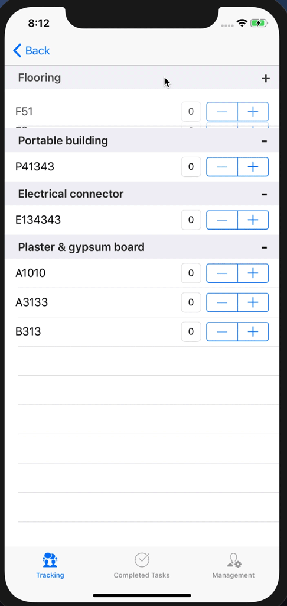
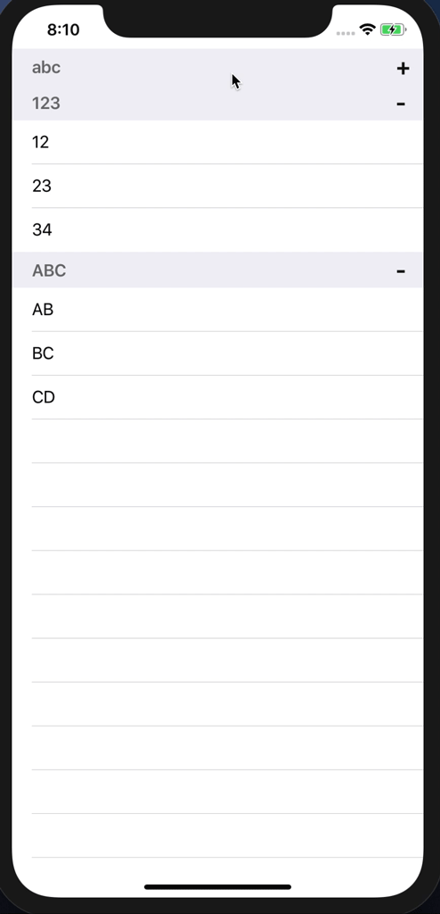

# HoExpandableTableView

[](https://cocoapods.org/pods/HoExpandableTableView)
[](https://cocoapods.org/pods/HoExpandableTableView)
[](https://cocoapods.org/pods/HoExpandableTableView)

## Screenshot

 
## Example

To run the example project, clone the repo, and run `pod install` from the Example directory first.

## Requirements

## Installation

HoExpandableTableView is available through [CocoaPods](https://cocoapods.org). To install
it, simply add the following line to your Podfile:

```ruby
pod 'HoExpandableTableView'
```

## Author

Eric He, eric.iosfan@gmail.com

## License

HoExpandableTableView is available under the MIT license. See the LICENSE file for more info.
